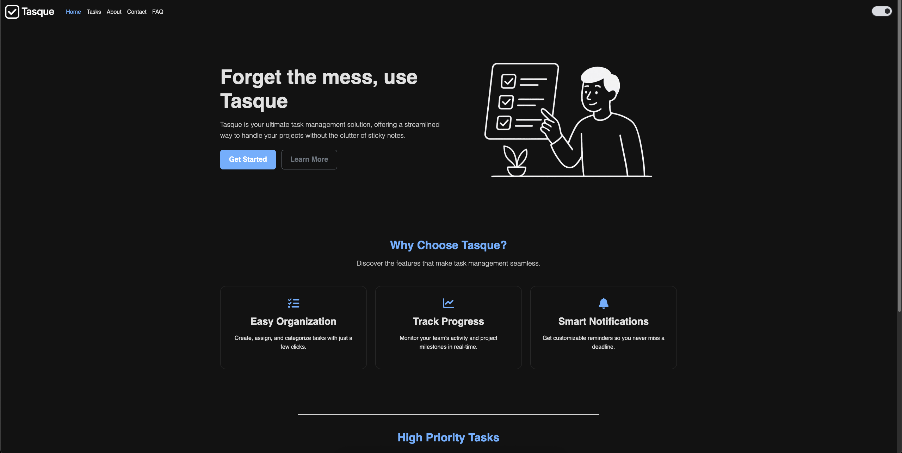
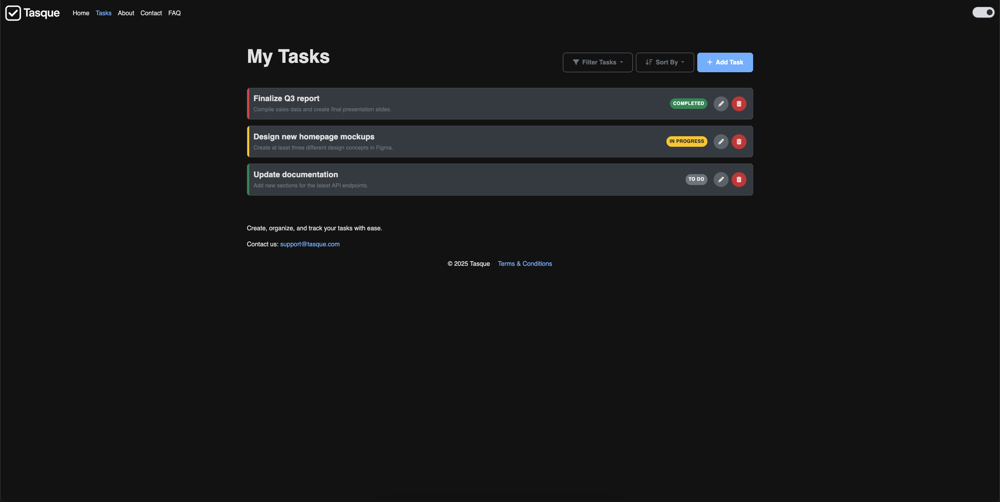
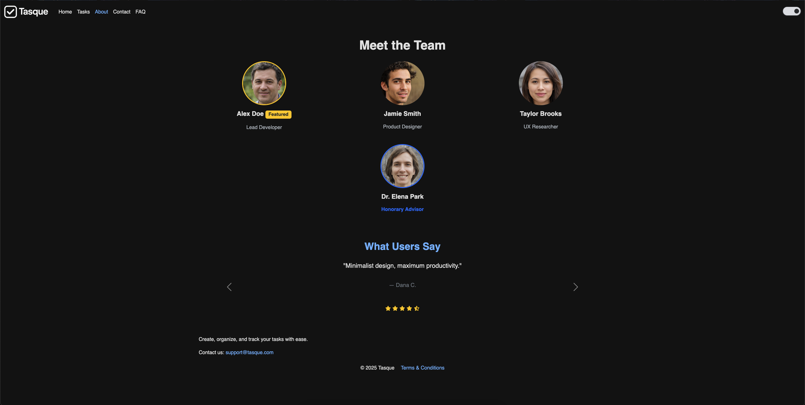
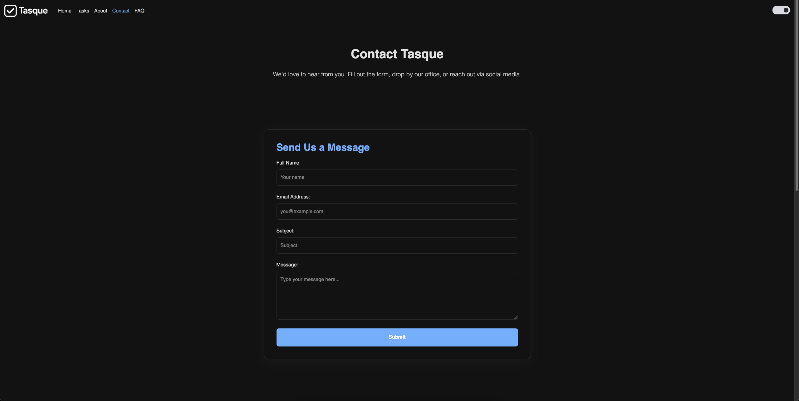
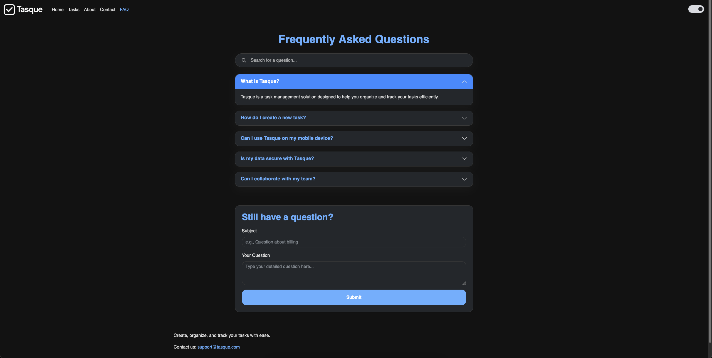

  

# Project Report: Tasque

Tasque is a sleek, responsive web app designed to help users manage their personal tasks with ease. It offers a clean and simple interface where tasks can be created, tracked, and organized efficiently. The project was built using HTML5, CSS3, and JavaScript, and enhanced with Bootstrap 5 and jQuery to deliver a smooth and modern user experience. Key features include full task management (CRUD), local data persistence, and a customizable light/dark mode that remembers your preferences.

---

## GitHub Repository
**Link:** [Click here](https://github.com/ipapidi/ITC-4214-Midterm-Ioli_Papidi) 
**Download ZIP:** [Click here to download](https://github.com/ipapidi/ITC-4214-Midterm-Ioli_Papidi/archive/refs/heads/main.zip)

---

## Key Features

- **Full Task Management:** Add, view, edit, and delete tasks through a user-friendly modal system.
- **Local Storage Persistence:** Your tasks are saved in the browser, so they're always there, even after you close the tab.
- **Filtering & Sorting:** Easily filter tasks by status or priority and sort them to stay on top of what matters most.
- **Mobile-First Design:** Thanks to Bootstrap 5, Tasque looks and works great on all screen sizes.
- **Dark Mode Toggle:** A theme switcher lets you choose between light or dark mode, and remembers your choice.
- **Homepage Carousel:** The homepage highlights your high-priority tasks in an auto-scrolling carousel.
- **Live Search FAQ:** The FAQ section includes a real-time search feature to help users find answers quickly.

---

## Visual Showcase

<table>
  <tr>
    <td width="20%" align="center"><strong>Home Page</strong></td>
    <td width="80%"><em>The main landing page with a hero section and a dynamic "High Priority Tasks" carousel.</em></td>
  </tr>
  <tr>
    <td colspan="2"></td>
  </tr>
  <tr>
    <td align="center"><strong>Tasks Page</strong></td>
    <td><em>The core of the application, where users can manage their tasks. Features include add, edit, delete, filter, and sort functionality.</em></td>
  </tr>
  <tr>
    <td colspan="2"></td>
  </tr>
  <tr>
    <td align="center"><strong>About Page</strong></td>
    <td><em>Introduces the fictional team behind the project.</em></td>
  </tr>
  <tr>
    <td colspan="2"></td>
  </tr>
    <tr>
    <td align="center"><strong>Contact Page</strong></td>
    <td><em>Provides a contact form, social media links, and an embedded map.</em></td>
  </tr>
  <tr>
    <td colspan="2"></td>
  </tr>
  <tr>
    <td align="center"><strong>FAQ Page</strong></td>
    <td><em>A frequently asked questions page with a live search filter.</em></td>
  </tr>
  <tr>
    <td colspan="2"></td>
  </tr>
</table>

---

## Technical Implementation

### a. HTML Structure, Titles, and Metatags

Each page is built with semantic HTML5 tags like `<nav>`, `<main>`, and `<footer>` for clarity and accessibility. The `<head>` of each document is populated with a descriptive `<title>` and essential `<meta>` tags, including `charset="UTF-s"`, `http-equiv="X-UA-Compatible"`, and `name="viewport"` to ensure proper rendering, character encoding, and a mobile-friendly, responsive layout.

### b. Task Management Logic

The "Tasks" page contains the core application logic, managed entirely by `tasks.js` using jQuery. The system is designed around a single source of truth—an array of `task` objects. All operations (create, read, update, delete) modify this array and then call a master `render()` function to update the UI.

- **State Management:** All tasks are held in a `tasks` array. This state is persisted in the browser's `localStorage` as a JSON string under the key `tasque_tasks`, ensuring data is not lost between sessions.
- **CRUD Operations:**
    - **Create & Update:** A single Bootstrap modal is used for both creating and editing tasks. The form submission handler checks for a hidden `taskId` input. If an ID exists, it updates the corresponding task in the array; otherwise, it creates a new task object and adds it to the array.
    - **Read:** On page load, the `load()` function retrieves tasks from `localStorage`. If no data exists, it gracefully initializes the application with the sample tasks present in the initial HTML.
    - **Delete:** A confirmation prompt (`confirm()`) is used to prevent accidental deletion.
- **Filtering and Sorting:** The UI provides controls to filter tasks by status (`todo`, `in-progress`, `completed`) or priority (`low`, `medium`, `high`) and to sort them. These actions update `currentFilter` and `currentSort` state variables, and the `render()` function re-generates the task list based on these values.

### c. JavaScript Structure

The JavaScript is organized into three modular scripts that handle distinct responsibilities:

- **`main.js` (Theme Management):** This script manages the light/dark mode theme. It runs immediately on page load to set the theme based on the value in `localStorage` (key: `theme`), preventing a "flash of unstyled content." It then attaches an event listener to the theme toggle, which updates both the `data-theme` attribute on the `<html>` element and the value in `localStorage`.
- **`tasks.js` (Core Task Logic):** This is the largest script and handles all functionality on the `tasks.html` page. It uses the `document.ready()` function from jQuery to ensure the DOM is fully loaded before executing. Its key responsibilities include loading/saving data, rendering the task list, handling form submissions, and managing event listeners for all task-related actions.
- **`latest-activity.js` (Homepage Carousel):** This script powers the "High Priority Tasks" carousel on the homepage. It loads the task array from `localStorage`, filters it to find tasks with a `priority` of "high," sorts them to show the most recent, and dynamically injects the top three results into the Bootstrap carousel component. If no high-priority tasks are found, it displays a friendly message.

### d. CSS & Responsiveness

Bootstrap 5 provides a solid, responsive foundation. A custom `style.css` file adds dark mode support and styling unique to Tasque.

### e. Pages & Interactivity

- **Header & Footer:** A sticky header and footer appear on every page. The footer also includes a modal for Terms & Conditions.
- **Static Pages:** "About" and "Contact" provide context and ways to get in touch.
- **Dynamic Elements:** The homepage carousel and live-search FAQ bring interactivity and usefulness beyond static content.

---

## Version Control & Reflections

### a. GitHub Workflow

The project was developed using Git with a clean, feature-based workflow. Regular, focused commits made version tracking easy and organized.

### b. Development Experience

Building Tasque challenged me to apply a full range of front-end development skills. From structuring JavaScript modules to handling real-time UI updates and theme persistence, deepening my understanding of state management, modular code design, and mobile-first development. A key challenge was implementing a seamless data persistence solution with `localStorage` that worked reliably across different browsers. Another was designing a fully responsive UI that maintained its usability on all screen sizes, which required careful planning and extensive testing. These challenges taught me the importance of problem-solving and agile development practices. The experience reinforced the value of designing with the user in mind and ensuring robust offline functionality.

---

## Author

- **Name:** Ioli Papidi
- **Username:** [ipapidi](https://github.com/ipapidi)
- **ID:** 241317